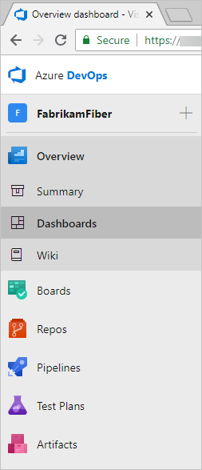

# Notes

- This is a good baseline document to use to build out the content below: <https://docs.microsoft.com/en-gb/azure/devops/organizations/accounts/organization-management?view=azure-devops>
- I'm looking to be more perscriptive and creating a few visuals to bring it to life.
- Just brain dumping for now below, but using the above to structure and content details.

- Organization Structure is already documentated: <https://docs.microsoft.com/en-us/azure/devops/user-guide/plan-your-azure-devops-org-structure?view=azure-devops>
- <https://docs.microsoft.com/en-us/azure/devops/user-guide>

-

Example

As we already have documentation. I'm thinking of changing this to a checklist  /decision tree that links back to our documentation

Checklist

1. [Organization Management](https://docs.microsoft.com/en-us/azure/devops/organizations/accounts/organization-management?view=azure-devops)
   1. [Plan your Organization Structure](https://docs.microsoft.com/en-us/azure/devops/user-guide/plan-your-azure-devops-org-structure?view=azure-devops)
      - What's an Organization?
      - [How many organizations do I need?](#one-or-multiple-organizations)
      - Map organizations and/or projects to business units
      - What's a Team?
      - What's a Project?
      - How many Projects do I need?
        - Single or multiple projects?
      - What's my repository strategy?
      - One or Many Repos?
      - Shared vs forked repos?
   2. [Create an Organization](https://docs.microsoft.com/en-us/azure/devops/organizations/accounts/create-organization?view=azure-devops)
      - Remember an Owner for the organization is required.
      - URL for logging into the new organization is <https://dev.azure.com/{yourorganization>}
   3. [Setup Billing](https://docs.microsoft.com/en-us/azure/devops/user-guide/manage-organization-collection?toc=%2Fazure%2Fdevops%2Forganizations%2Ftoc.json&bc=%2Fazure%2Fdevops%2Forganizations%2Fbreadcrumb%2Ftoc.json&view=azure-devops#set-up-billing)
   3. [Manage Access to your Organization](https://docs.microsoft.com/en-us/azure/devops/organizations/security/about-permissions?view=azure-devops)
      - Access
      - Access Levels
      - [Permissions](https://docs.microsoft.com/en-us/azure/devops/user-guide/manage-organization-collection?toc=%2Fazure%2Fdevops%2Forganizations%2Ftoc.json&bc=%2Fazure%2Fdevops%2Forganizations%2Fbreadcrumb%2Ftoc.json&view=azure-devops#manage-security-and-permissions)
      - Add users at different levels
        - [Add users to your organization](https://docs.microsoft.com/en-us/azure/devops/organizations/accounts/add-organization-users?view=azure-devops)
        - [Add users to a Team](https://docs.microsoft.com/en-us/azure/devops/organizations/security/add-users-team-project?view=azure-devops#add-users-to-a-team)
        - [Add users to a project](https://docs.microsoft.com/en-us/azure/devops/organizations/security/add-users-team-project?view=azure-devops#add-users-to-a-project)
      - Manage users with AAD
        - Connect you organization to AAD
        - Add users to AAD
        - Add AAD groups to ADO groups
        - Best practice
          - Manage users via security groups
       - [Restrict organization creation with tenant policy](https://docs.microsoft.com/en-us/azure/devops/organizations/accounts/azure-ad-tenant-policy-restrict-org-creation?view=azure-devops)
        -

2. [Projects](https://docs.microsoft.com/en-us/azure/devops/user-guide/project-admin-tutorial?view=azure-devops)
   - [Create a Project](https://docs.microsoft.com/en-us/azure/devops/organizations/projects/create-project?view=azure-devops&tabs=browser)
   - [Structure your project](https://docs.microsoft.com/en-us/azure/devops/organizations/projects/about-projects?view=azure-devops#project-structure)
   - [Add team to project](https://docs.microsoft.com/en-us/azure/devops/organizations/projects/about-projects?view=azure-devops#when-to-add-a-team-scaling-agile-tools-across-the-enterprise)

3. [Repos](https://docs.microsoft.com/en-us/azure/devops/repos/get-started/sign-up-invite-teammates?view=azure-devops)
   - [Create Repo](https://docs.microsoft.com/en-us/azure/devops/repos/git/create-new-repo?view=azure-devops)
4. [Teams](https://docs.microsoft.com/en-us/azure/devops/organizations/settings/manage-teams?toc=%2Fazure%2Fdevops%2Fget-started%2Ftoc.json&bc=%2Fazure%2Fdevops%2Fget-started%2Fbreadcrumb%2Ftoc.json&view=azure-devops)
5. [Boards](https://docs.microsoft.com/en-us/azure/devops/boards/get-started/what-is-azure-boards?view=azure-devops)
   - [Area Paths](https://docs.microsoft.com/en-us/azure/devops/organizations/settings/about-areas-iterations?toc=%2Fazure%2Fdevops%2Freference%2Ftoc.json&bc=%2Fazure%2Fdevops%2Freference%2Fbreadcrumb%2Ftoc.json&view=azure-devops)
   -
6. Tags
7. [Pipelines](https://docs.microsoft.com/en-us/azure/devops/pipelines/get-started/what-is-azure-pipelines?view=azure-devops)
   - [Create first pipeline](https://docs.microsoft.com/en-us/azure/devops/pipelines/get-started/pipelines-get-started?view=azure-devops)

8.  

9. Security

    -

10.

# Azure DevOps Setup and Operating Model

Azure DevOps has a number of different services that need to be considered when setting up the service and the operational model to support the use and adoption by teams. It's key to look at the structure of an orgnaisation to best align this model for supporting growth and usability movings forward.

This guide is prescriptive in providing a way to get started with a view to scale moving forward.

## Get Started

Azure DevOps consists of a number of different structures and products that need to be considered where setting up the service.

I few key products are:

[Azure DevOps](https://docs.microsoft.com/en-us/azure/devops)  

This main sections that will be looked at below are:

- Organization
- Project
- Repos
- Pipelines

-  

## Organization

### What is an Organization?

It's the primary entity point (e.g. <https://dev.azure.com/{yourorganization>}) into Azure DevOps where projects and supporting products are hosted.

### One or Multiple Organizations

One organization works for most scenarios and is a good starting point where multiple projects and teams can be added to an organization, which can drive productivity and adoption initially.  

Going with a multiple organizations model is generally driven by the need for teams and projects to work in isolation and/or require a different security model across different of a company.

## Teams

tbc - roles

## Projects

An organsaition can have multiple projects and it's key to look at the project structure. Asking questions like

- Do we need one project per Team?
- Do we need one project per Business Area?
- Do we need one project per product?
- How do we collabvorate across teams and projects?
- How much organisational structure change do we expect?

The questions above start to build out a picture that informs the Azure DevOps project and also can impact the organisation design.

As if there's a lot of organisational sturcture change. How would you make sure the Azure DevOps design can handle it without a lot of redesign and moving projects and teams around?

Some examples:

- By creating a project per Business Process Area (e.g. Payments) if the names and structure of the organisation changes the Payments BPA project should still be valid including the team membership.
...

## Repositories

## Boards

## Pipelines

## Additional

### Area Paths

### Tagging

## Next steps

TBD

Example 1 - Have Azure AAD tenant already

1. Plan Azure DevOps Organizational Structure
2. Organizational
   1. Create Azure DevOps Organization
   2. Restrict organization creation with tenant policy in Azure
   3. Setup AAD Integration
   4. Manage Users access via Security Groups. (Best Practice)
   5. Define process for Access, Roles and Permissions at Organizational level (tbc - build out more info)
      1. Roles and Responsibilities (tbc)
   6. Setup Billing for Organization
   7. Review Policies
   8. Review and update Boards processes
3. Project
    1. Define process for Access, Roles and Permissions at Project and Team level prior to creation of first project. (tbc - build out more info)
        1. Roles and Responsibilities (tbc)
    2. Define process for Service Connections and Agent Pools
    3. Create Project
    4. Apply process from 1 and 2 above.
4. Boards
    1. Review process's setup in the Organization.
    2. Configure the Team configuration for Backlogs, working days, bugs, iterations, areas and templates.
    3. Optional, setup GitHub connection for linking Boards to a GitHun repo.
    4. Config the Teams Board for their ways of working (e.g. workflow, swimlanes, styles and fields)
5. Repositories
    1. Define and branching strategy for the Team when working with a repo.
    2. Set default branch name (e.g. main)
    3. Apply policies to the repo.
    4. Review and apply security groups and roles to repo.
    5. Dev team to agree approach to repo's for their applications:
        1. One vs. many
        2. Shared vs. Forked
    6. Define process for Access, Roles and Permissions at repo level based on above requirements.
6. Pipelines
    1. Best practice is to move to YAML pipelines for both build and release pipelines.
    2. This allows for managing the pipelines as code and storing them in repos to drive consistency and audibility linked to builds and releases.
    3. Agent Pools
         1. For security and scalability its recommended  to use safe-hosted agents for pipelines.

    4.
