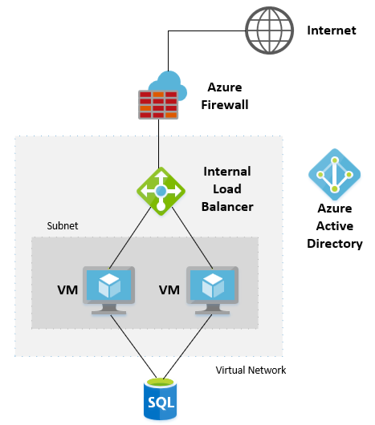

# Azure Monitoring and Observability Configuration

Azure provides cloud-based tools to allow you to monitor across all levels of your software stack and also the underlying compute, storage and networking components provided by Azure itself. 
The issue every business faces is understanding what services and solutions deliver end-to-end visibility to ensure quick resolution of anomolies and ensure performance and availability are maintained within SLAs. Moreover, in addition to the Technology focus for monitoring we need to establish a baseline for both People and Process.

## Get Started with a strategy

The Microsoft Cloud Adoption Framework for Azure is a full lifecycle framework that enables cloud architects, IT professionals, and business decision makers to achieve their cloud adoption goals. It provides best practices, documentation, and tools that help you create and implement business and technology strategies for the cloud.

Within the Cloud Adoption Framework is existing documentation that details how you should formulate a monitoring strategy:

https://docs.microsoft.com/en-us/azure/cloud-adoption-framework/strategy/monitoring-strategy

## Organising your teams

Depending on the size of your organisation and your cloud maturity there are several options on how you may handle cloud monitoring. 

Again, the Cloud Adoption Framework has some guidance on organisational alignment and how you begin to move your teams towards delivering cloud functions.

https://docs.microsoft.com/en-us/azure/cloud-adoption-framework/organize/organization-structures

https://docs.microsoft.com/en-us/azure/cloud-adoption-framework/organize/raci-alignment

If you are new to the cloud you want to get to a position where you at least implement an organisational MVP. This is where you have one or more Cloud Adoption teams that are deploying resources held to account by a Cloud Governance team. 
As you'll see from the links above, the responsibility for monitoring is split between both teams: platform operations are handled by the Governance team and solution operations are handled by the Cloud Adoption teams.

talk about how, with the MVP, only 2 teams so have to wear multiple hats.
According to RACI doc (give link), we are looking at Governance team assuming the Cloud Platform function and CLoud Adoption teams becoming accountable for cloud operations.

quote the deliverables of each team :... 

As you grow in maturity you may wish to move towards a more mature enterprise scale organisational model and hence we would see the introduction of Cloud Operations and Cloud Platform teams.

## Defining your monitoring

https://docs.microsoft.com/en-us/azure/cloud-adoption-framework/manage/monitor/

https://docs.microsoft.com/en-us/azure/cloud-adoption-framework/manage/monitor/cloud-models-monitor-overview

The goal of this guide is to provide a detailed reference to help enterprise IT managers, business decision makers, application architects, and application developers understand:

Azure monitoring platforms, with an overview and comparison of their capabilities.
The best-fit solution for monitoring hybrid, private, and Azure native workloads.
The recommended end-to-end monitoring approach for both infrastructure and applications. This approach includes deployable solutions for migrating these common workloads to Azure.

There are also clear recommendations in the Azure Landing Zone documentation that cover best practices for platform implementation. Therefore, we should also take the into consideration as we build out some key recommendations.

need to add ! ESLZ link to design areas??
  
## Consider the tools to build your monitoring solution

Your organization should plan to build standardized solutions using a combination of tools such as:

Azure Resource Manager templates.
Azure Policy monitoring initiative definitions and policies.
GitHub to establish a source control for the scripts, code, and documentation.

In addition, there are some key components that will figure in your monitoring suite:

- Azure Monitor including Log Analytics workspace and playbooks
- Microsoft Defender For Cloud
- Azure Service Health
- Azure Resource Health
- Azure Policy and Blueprints
- Azure ARC
- Azure Automation
- Logic Apps
- Event Hubs
- Sentinel

## Our Recommendations to start

You should understand that your monitoring strategy will evolve over time and be careful not to delay by ensuring you have every base covered.
Your first objective is to ensure "Observability." You need to capture some key information about your resources which will allow you to both monitor your environment but also learn for future evolution.

This is based on the MVP of 2 teams: adoption and governance where these teams are assigned the functions of cloud operations and cloud plaftorm.

Consider this sample architecture which is hosted in a single region:

We should ask ourselves these core questions:
1. [Who](monitoring.md#who) - Who cares and responds to alerts?
2. [What](monitoring.md#what) - What are we going to monitor and alert on?
3. [How](monitoring.md#how) - Which tools are we going to use?
4. [Optimisation](monitoring.md#optimise) - How can we review & improve our monitoring posture?

## Cloud Platform Monitoring
### Who ###

Remember that, in this example, we are considering the two-team MVP organisational model: Adoption and Governance.
The logs and metrics we are capturing will fit into one of two groups:

- Cloud Platform: Platform logs and metrics provide detailed diagnostic and auditing information for Azure resources and the Azure platform they depend on.
- Application/Solution: Logs and metrics associated with the application code

Referencing the roles here (insert link to Will's doc), the following roles map to the two teams:
(insert roles and assign to one of the two teams)

### What ###

Before you do anything, the first step is to understand exactly what is available to you in terms of logs and metrics.
Logs and metrics will almost certainly vary between Azure services, but there will be some commonality. Regardless of this, you will need as comprehensive a list as possible so that you can determine which logs and metrics to monitor. 

These are the steps we recommend you take:

- Analyse the solution architecture and identify each of the Azure components included and list them.
- For each Azure service export all of the Azure logs and metrics available for that service and list them.
- Mark the logs and metrics you wish to monitor.
- For each selected log and metric identify which you require alerts for and to what threshold.

Considering the sample architecture, we have the following components to consider:

- Azure Firewall https://learn.microsoft.com/en-us/azure/firewall/logs-and-metrics
- Internal Load Balancer https://learn.microsoft.com/en-us/azure/load-balancer/monitor-load-balancer
- Virtual Machines https://learn.microsoft.com/en-us/azure/virtual-machines/monitor-vm
- Virtual Network https://learn.microsoft.com/en-us/azure/virtual-network/monitor-virtual-network
- SQL PaaS Database https://learn.microsoft.com/en-us/azure/azure-sql/database/monitoring-sql-database-azure-monitor?view=azuresql
- Azure Active Directory https://learn.microsoft.com/en-us/azure/active-directory/reports-monitoring/concept-activity-logs-azure-monitor
- Security Microsoft Defender for Cloud (need URL)

Listing all of the logs and metrics involved reviewing the Azure documentation and the corresponding links have been included above for your convenience.

In this example, we would advocate the following logs and metrics based on both the [Cloud Adoption Framework Landing Zone design](https://learn.microsoft.com/en-us/azure/cloud-adoption-framework/ready/landing-zone/) and [Well-Architected Framework](https://learn.microsoft.com/en-us/azure/architecture/framework/) documentation:

### The First Steps

Considerations:
- Establish a basline of services
- Consider using tools such as an Azure Monitor Log Analytics workspace as administrative boundaries

Recommendations:
- Deploy a central Log Analytics workspace for platform operations. This will be in your Management subscription as part of the platform.

### Azure Firewall
TBD

### Internal Load Balancer
TBD

### Virtual Machines
TBD

### Virtual Network
TBD

### SQL PaaS Database
TBD

### Azure Active Directory

Send all Azure AD diagnostic logs to a central Azure Monitor Log Analytics workspacefollowing the
guidance here: Integrate Azure AD logs with Azure Monitor Logs

## Security

TBD 
Enable MS Defender for Cloud

### How ###

Cloud Platform Logs and metrics:
Create one or more Log Analytics workspaces.
1 per region as per guidelines - these will capture platform logs. 

Application Logs and metrics:
Create separate LAW in spoke subscription?? Need to check ALZ guidance

Azure Monitor workbooks on github - https://github.com/microsoft/AzureMonitorCommunity/tree/master/Scenarios
TBC

### Optimise ###

TBD

## Application Monitoring

###The First Steps

Considerations:

Recommendations:
- Deploy a workload-specific Log Analytics workspace for application logging. This will be in your workload subscription.

### Application Logging

App Insights

## Next Steps

TBD 
