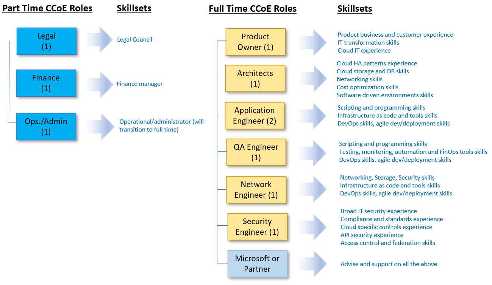

# Organisation Team Structures and Roles

It is important to identify all of the roles required for operating a cloud environment and to insure that named member(s) of the team is(are) assigned to those roles. The image below provides an example of a suitable set of team roles.

## Team Roles

**Product Owner:** This role owns the backlog for the workload in scope for deployment. Linked to the organisation's business objectives, this role defines the user stories, places them into the backlog and sets their priority. Additionally this role will be continuosly consulted, attending daily stand-ups and sprint retrospective meetings, to provide feedback against deliverables in order to determine what additional stories may be required. As the voice of the customer, this role will also involve assembly of assoicated customer facing collateral.

**Architect:** This role is responsible for the architectural execution of the backlog. This includes [identifying all Azure and hybrid services](structures-and-roles.md) involved in the creation of a complete production workload solution across the entire stack and how these services will work together to achieve the backlog story objectives. This role involves proposing options for Azure services where applicable, identifying all dependencies, documenting these solutions architectures on the [wiki](structures-and-roles.md) and working with the product owner to augment, refine and categorise the user stories on the backlog.

**Application Engineer:** This role is responsible for the software development, management, configuration and deployment of the software application to the target platform. Additionally this role will be responsible for the configuration and deployment of some associated infrastructure resources. This will involve the deployment of both software applications and associated infrastructure as code using CI/CD pipelines. This role will manage and version control the associated application software, libraries, artifacts, configuration, pipelines and infrastructure as code resources.

**Quality Assurance (QA) Engineer:** 
TBD

**Network Engineer:** 
TBD

**Security Engineer:** 
TBD

**Microsoft and Partner Support:** 
TBD

**Legal Advisory Support:** 
TBD

**Finance and Procurement Support:** 
TBD

**Operational Administration Support:** 
TBD

## Get Started

TBD

## Next steps

TBD
