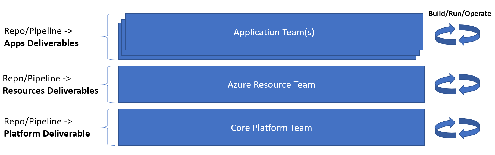

# Organisation Team Structures and Roles

It is important to identify all of the roles required for operating a cloud environment and to insure that named member(s) of the team is(are) assigned to those roles. The image below provides an example of a suitable set of team roles.

## Team Roles

**Product Owner:** This role owns the backlog for the workload in scope for deployment. Linked to the organisation's business objectives, this role defines the user stories, places them into the [backlog](structures-and-roles.md) and sets their priority. Additionally this role will be continuosly consulted, attending daily stand-ups and sprint retrospective meetings, to provide feedback against deliverables in order to determine what additional stories may be required. As the voice of the customer, this role will also involve assembly of assoicated customer facing collateral.

**Architect:** This role is responsible for the architectural execution of the backlog. This includes [identifying all Azure and hybrid services](structures-and-roles.md) involved in the creation of a complete production workload solution across the entire stack and how these services will work together to achieve the backlog story objectives. This role involves proposing options for Azure services where applicable, identifying all dependencies, documenting these solutions architectures on the [wiki](structures-and-roles.md) and working with the product owner to augment, refine and categorise the user stories on the backlog.

**Application Engineer:** This role is responsible for the development, management, configuration and deployment of the software application to the target platform. Additionally this role will be responsible for the configuration and deployment of some associated infrastructure resources. This will involve the deployment of both software applications and associated infrastructure as code using CI/CD pipelines. This role will manage and version control the associated application software, libraries, artifacts, configuration, pipelines and infrastructure as code resources.

**Quality Assurance (QA) Engineer:** 
This role is responsible for the testing and quality of all releases and associated tools. This encapsulates the responsibility for providing input for "definition of done" quality criteria, automated and manual testing, monitoring and alerting, observability, cost management, code quality (both application and infrastructure pipeline), chaos engineering and associated tools. This will involve the deployment of the associated test environments as code using CI/CD pipelines.

**Network (Platform) Engineer:** 
This role is responsible for core platform infrastructure design, development and management. This will typically involve all core platform components including virtual networks, routing, firewalls, DNS, VPN, private connectivity, IP address allocation, DMZ public IP address management, third part connectivity, IDS/IPS solutions and associated infrastructure as code. This will involve the deployment of the associated infrastructure as code using CI/CD pipelines.

**Security Engineer:** 
This role is responsible for all security aspects of delivered workloads against the expected organisation security policies. This role will span the architecture, design of built in security at all levels of the IT stack, through network security, identity and access management, secure resource configuration patterns, application and code security. Additionally this role is responsible for associated security monitoring tools, alerting, dashboards and built in security to all CI/CD deployment pipelines. As for the other roles, security should also be managed through infrastructure as code using CI/CD pipelines. 

**Microsoft and Partner Support:**
This isn't really a different role as such, more an indicator that organisations that are short on technical staff with the right expertise can seek to engage one of the many Azure cloud partners out there to augment their teams. These partners bring a lot of experience of cloud deployment and management and so can provide a fast start to getting going with a landing zone and operational best practices as well providing first hand education to existing team members. Engineers from partners can fill any of the identified roles. 

**Legal Advisory Support:** 
This is a part-time role that is not attending daily [standups](structures-and-roles.md) like the rest of the full-time members. This role is called out because there will be occasions when support from the legal team is required, relating to associated contracts, IP, terms and conditions etc. 

**Finance and Procurement Support:** 
This is a part-time role that is not attending daily standups like the rest of the full-time members. This role is called out because there will be occasions when support from the finance and procurement team will be required, especially with respect enterprise agreements, cloud financial reporting, partner engagement etc.

**Operational Administration Support:** 
This is a part-time role that is not attending daily standups like the rest of the full-time members. This role is called out because there will be occasions when operational support is required, especially with respect first line support for queries, associated documentation, communication channels, tools and service level issues etc. 

## Team Organisation

Having identified the key roles, to scale a modern cloud operating model across a large organisation, it is important setup your DevOps teams to maximise the benefits of collaboration and agility. A key principle here is to strike the right balance between central process and governance whilst still permitting autonomy within DevOps teams across the organisation. While it may seem obvious to talk about a DevOps team per IT workload and application it is often not quite as simple as that, as there are typically a number of core or shared elements that need to be in place for these projects to progress. For example, commercial licensing and enterprise agreements, issuing Azure subscriptions, shared network services and IP address allocation, shared security and monitoring solutions, common development tooling, reusable organisational compliant resource configuration patterns etc.

As a result, in addition to IT workload and application specific DevOps teams, there are likely to be core cloud DevOps teams to cover these areas. As a starting point there could be the following core DevOps teams.

Each team should have a full stack of roles assigned to it, resulting in the teams and roles being organised as follows. There will likely be dependencies between teams that vary in complexity depending upon the nature of the project. For example a straight forward stand-alone project with minimal interconnectivity requirements, existing resource patterns that require no major modification would have a minimal dependency, only requiring the provision of a suitable base subscription to which standard approved patterns can be deployed. For a more complex project with many hybrid connection requirements, new or heavily modified Azure service patterns not previously used, this would likely have a greater number of cross team dependencies. As agility is the key, team deliverables and scope should be clearly understood so that cross team dependencies are minimised and application teams maintain as much autonomy and agility as possible.

> [!NOTE]
> It may look as if the above is proposing 5 x 7 = 35 staff. However, this is not necessarily the case. These are 'roles' that need a name against them, not necessarily separate different individuals i.e. the same role could be covered by the same individual in different teams or a one individual could even cover multiple roles.
>

## Team Function

### Core Platform Team
The focus for this team is shared foundational core services that revolve around the provision of an Azure landing zone that caters for a solid cloud governance model. So this will include management and design of Azure tenants, subscriptions, Azure AD, hub and spoke networking, Express Route, VNets, peering, IP address allocation, shared firewalls and other required network appliances, security compliance and controls etc.

### Azure Resource Team
The rationale for this team may be less clear and infact the functions of this team could be merged into the Core Platform Team. However, the reason for a separate team is to separate the activities associated with Azure resource design and configuration from core design tasks. An example could be deployment of Azure Kubernetes Service (AKS) or Azure App Service where there is a significant design element and management overhead associated with the service. The role here is to create approved and re-usable patterns, delivered as code, for deploying Azure resources, configured to satisfy all security, availability and governanve requirements. 

### Application Team
TBD

## Get Started

**Create a Backlog and Board**
TBD

**Create a Wiki**
TBD

**Select a CI/CD technology**
TBD

## Next steps

TBD
